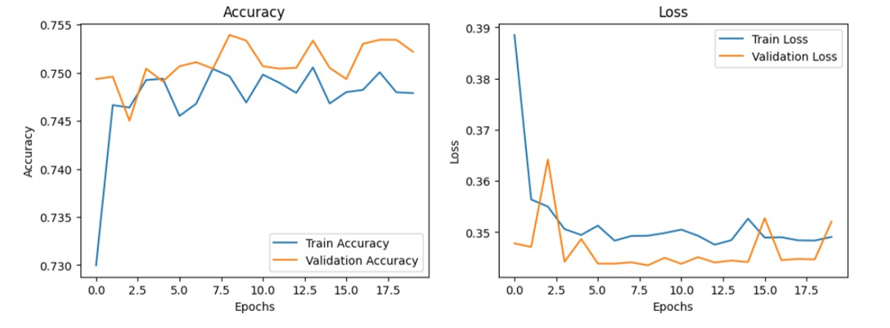
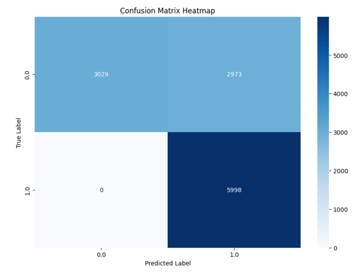

# Hardware Software Co-Design of Multi Receiver Narrowband Spectrum Sensing for Cognitive Radio using Deep Learning

## Overview

Spectrum sensing is a process that detects the presence of licensed signals in a specific frequency band. It's a crucial step in cognitive radio-based dynamic spectrum management. In this project, we focus on **Narrowband Spectrum Sensing**, which evaluates a single frequency and determines if a transmitter is active on that frequency.

## Dataset

Our model is trained on the **Simulation Training/Test Data for DS2MA Spectrum Sensing Model** by Keunhong Chae, Sungkyunkwan University. The dataset characteristics include:

- Consists of QPSK modulated signals
- Samples 8 receivers, with sample length of 10000
- Signal present/absent labeled data is available for various SNR values
- Classified on the basis of noise present in signal (Gaussian/Impulsive)

## Methodology

Our work utilizes the spectrum sensing scheme proposed by Keunhong Chae and Yusung Kim from Sungkyunkwan University, which constructs a correlation matrix composed of not only auto-correlation functions per each antenna but also cross-correlation functions between antennas. The data preprocessing pipeline follows these steps:

1. **Initial data format**: (Nd, 8, Ns, 2), where:
   - Nd = length of dataset
   - Ns = Sample Length

2. **Calculate Autocorrelation matrix [A]**: (Nd, 8, Ns, 2)

3. **Calculate Cross Correlation matrix [C]**: (Nd, 28, Ns, 2)

4. **Create [A C] matrix**: (Nd, 36, Ns, 2)

5. **Data augmentation**: Randomly mixed and merged samples with gaussian and impulsive noise

6. **Training configuration**: Samples with SNR -17dB were utilized for training and inference

## Model Architecture

The CNN model consists of the following layers:

| Layer | Type | Output Shape | Parameters |
|-------|------|--------------|------------|
| input_1 | InputLayer | (None, 36, 1000, 2) | 0 |
| conv2d | Conv2D | (None, 34, 998, 48) | 912 |
| max_pooling2d | MaxPooling2D | (None, 17, 499, 48) | 0 |
| conv2d_1 | Conv2D | (None, 15, 497, 96) | 41568 |
| max_pooling2d_1 | MaxPooling2D | (None, 7, 248, 96) | 0 |
| conv2d_2 | Conv2D | (None, 5, 246, 192) | 166080 |
| max_pooling2d_2 | MaxPooling2D | (None, 2, 123, 192) | 0 |
| flatten | Flatten | (None, 47232) | 0 |
| dense | Dense | (None, 128) | 6045824 |
| dropout | Dropout | (None, 128) | 0 |
| dense_1 | Dense | (None, 1) | 129 |

**Total parameters**: 6,254,513 (23.86 MB)

## Model Performance

### Validation Results
- **Precision**: 0.6686
- **Recall**: 1.0000
- **F1 Score**: 0.8014
- **Confusion Matrix**: [[3029, 2973], [0, 5998]]

### Test Results (100 random samples)
- **Test Accuracy**: 73.00%
- **Test Loss**: 33.37%




## Model Quantization

The wide range of data in the dataset, ranging from 1 to e(-14), presents a unique challenge in quantizing the data. Key quantization features:

- Traditional int8 quantization cannot preserve data and results in heavy loss in accuracy
- **BF16 (Brain Float 16)** quantization implemented for optimal performance
- Preserves the 8bit Exponent of the FP32 format, resulting in same range of representable values
- Results in significant resource savings in terms of BRAM usage
- Can be easily converted to and from FP32 format with low data loss

### Quantization Results
- **BF16 Accuracy**: 0.7522
- **FP32 Accuracy**: 0.7536
- **INT8 Accuracy**: 0.4998

## Hardware Specifications

**Target Platform**: Microchip Icicle Kit with Polarfire® SoC

### Onboard Microprocessor Resources:
- 1x RV64IMAC core
- 4x RV64GC core

### Onboard FPGA Fabric Resources:
- 254K logic elements
- 144 User IO
- 17.6 Mbit total RAM
- 784 Math Blocks

## Hardware Design Goals

1. **CNN Acceleration**: Accelerate the CNN by performing 3x3 Convolution operation on fabric using a custom 3x3 MAC unit

2. **Comprehensive CNN Operations**: IP should be able to perform all operations in a CNN network up to the flatten layer including convolution and pooling with minimal control required from MSS side to reduce latency

3. **Flexible Configuration**: IP should be able to handle functions such as zero padding and variable stride as specified by the model

## Project Structure

```
VLSID_25/
├── models/           # Trained model files
├── data/            # Dataset and preprocessing scripts
├── preprocessing/       #Contains all preprocessing scripts and methods
├── software/        # Software implementation and testing
├── results/         # Training curves, confusion matrices, and performance metrics
└── docs/           # Documentation and references
```

## Getting Started

1. **Clone the repository**:
   ```bash
   git clone https://github.com/shubhamkamble200431/VLSID_25.git
   cd VLSID_25
   ```

2. **Install dependencies**:
   ```bash
   pip install -r requirements.txt
   ```

3. **Download the DS2MA dataset** and place it in the `data/` directory

4. **Run training**:
   ```bash
   python train.py
   ```

5. **Test the model**:
   ```bash
   python test.py
   ```

## References

- Chae, K., & Kim, Y. "DS2MA: A Deep Learning-Based Spectrum Sensing Scheme for a Multi-Antenna Receiver." IEEE Communications Letters.
- Sungkyunkwan University Spectrum Sensing Dataset

## Contributors

- Shubham Kamble
- Chaitanya Singh

